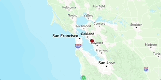

# My Summer Adventure Map

### DEMO

## What i built
["My Summer Adventure" Map](https://b0q16.github.io/My-First-Map-3/) 

## What is it
This is suppose to show what I did through out my 2025 summer trip. 

## Why I made this
I made this to a ton of places and I wanted this to show where I went and how much I did

## Technology
To build my app I used the below tools
  1. [Google My Maps](https://www.google.com/maps/d/u/0/), for generating the route lines, and exporting the geometries in `KML` format.
1. [togeojson](https://www.npmjs.com/package/@mapbox/togeojson) to convert `KML` files into `geoJSON`.
2. [Mapbox GL JS](https://docs.mapbox.com/mapbox-gl-js/guides) library, for styling and displaying maps and route lines, and adding camera behaviors (flyto animations).
3. [Google Sheets](https://docs.google.com/spreadsheets), for planning and line-by-line itineraries (including formulas to calculate durations), and publishing a single tab as an htm file.
4. [Visual Studio Code](https://code.visualstudio.com/download) free IDE, with [Live Server](https://marketplace.visualstudio.com/items?itemName=ritwickdey.LiveServer) and [Markdown All in One](https://marketplace.visualstudio.com/items?itemName=yzhang.markdown-all-in-one) extensions.
5. [GitHub pages](https://docs.github.com/en/pages/getting-started-with-github-pages/creating-a-github-pages-site), for publishing the app for free!
 
## Code snapshot

The small chunk of my code from 33-39 has the command to create and add the center of my map. This had me confused very badly, I had no idea how to create the center of my map and where to add it in the code. I kept mispalcing it throughout the code, the other locations of where Ive been in the summer.However a firend of mine helped me to figure out what I needed to do to add the center on my map. 